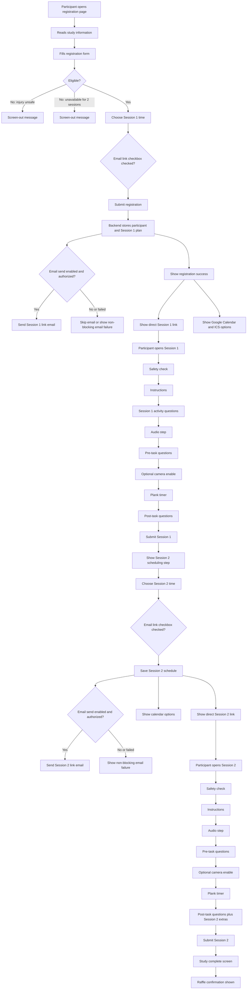

# Physical Performance Study App

This repository contains a mobile-first web app for running a two-session physical performance experiment. Participants register once, receive Session 1 access, complete a guided plank task with assigned audio, schedule Session 2, and then finish the study.

The app uses:

- Static frontend pages: [index.html](index.html) and [session.html](session.html)
- Shared client logic in [js/config.js](js/config.js), [js/calendar.js](js/calendar.js), and [js/session.js](js/session.js)
- A Google Apps Script backend in [apps-script/Code.gs](apps-script/Code.gs)
- Google Sheets for participant/session data and Google Drive for optional contact-sheet uploads

## What The App Does

The app supports the full study lifecycle:

- One-time registration with eligibility screening and consent
- Automatic Latin-square audio assignment
- Calendar link generation for each scheduled session
- Optional email delivery of the direct session link
- Guided, step-by-step session execution
- Plank timer capture
- Brief accidental-start return path right after the timer begins
- Pre-task and post-task survey collection
- Optional form-verification camera capture
- Manual audio stop control after the plank
- Session 2 scheduling after Session 1
- Final completion and raffle confirmation

## Workflow Diagram

## End-To-End Flow

### 1. Registration

Participants land on [index.html](index.html) and see:

- Study title: `Physical Performance Study`
- Trust line: `UC Berkeley student research study`
- Study description, confidentiality, and data-use language
- Contact email from `EXPERIMENT_CONFIG.researcherEmail`

They then complete the registration form. The app enables the submit button only when all required inputs for the current path are complete.

### 2. Eligibility Outcomes

There are three outcomes after registration submission:

- `screened_out_injury`
  - Triggered when the participant reports an injury or condition that makes a plank unsafe
  - The attempt is logged in `registration_attempts`
  - No group assignment or session link is shown
- `screened_out_availability`
  - Triggered when the participant says they cannot complete both sessions in the 24 to 72 hour window
  - The attempt is logged in `registration_attempts`
  - No group assignment or session link is shown
- `enrolled`
  - Triggered when the participant is eligible and completes all required enrollment items
  - The participant is added to `participants`
  - Session 1 time is stored
  - A group is assigned from the permutation list
  - The success screen shows the direct Session 1 link and calendar actions

If the email already exists, the backend returns `already_registered`. In that case the UI shows the next valid session link instead of creating a second participant row.

### 3. Registration Success Screen

After successful enrollment or duplicate detection, the success state can show:

- The participant email
- The assigned audio order
- The next session number and scheduled time
- A direct session link button
- Google Calendar and ICS download options
- A status line confirming whether the opt-in email was sent
- A raffle note explaining the gift-card raffle for participants who complete both sessions

### 4. Session Entry Rules

Participants open `session.html?email=...&session=N`.

On load, [js/session.js](js/session.js):

- Reads `email` and `session`
- Calls `doGet` on the Apps Script backend
- Verifies the participant exists
- Verifies the requested session is the next incomplete session
- Resolves the assigned audio track from the participant’s group

Invalid states are blocked:

- Missing URL parameters
- Unknown email
- Attempt to reopen an already completed session
- Attempt to skip ahead to a future session

### 5. Session 1 Workflow

Session 1 includes:

1. Safety check
2. Plank instructions
3. Session 1 only activity questions
4. Audio player
5. Pre-task questions
6. Optional camera enable with phone-positioning tips
7. Plank timer with brief accidental-start return option
8. Post-task questions
9. Manual audio stop available after the plank
10. Session 2 scheduling
11. Direct Session 2 link, calendar actions, optional Session 2 email

### 6. Session 2 Workflow

Session 2 is similar, but skips the Session 1-only activity block and adds three Session 2-only post-task questions:

- Ease of following instructions
- Overall experience participating in the study
- Retrospective perceived audio influence across both sessions

After Session 2 submission, the participant sees:

- Study completion message
- Raffle confirmation

## Registration Questions And Options

The registration form is defined directly in [index.html](index.html).

| Order | Field | Type | Required | Options / Notes |
|---|---|---|---|---|
| 1 | Email address | Email input | Yes | Used to match sessions and optionally send session links |
| 2 | Age | Number input | Yes | Integer-style numeric field |
| 3 | Gender | Radio | Yes | `Male`, `Female`, `Other` |
| 4 | Full name | Text input | No | Optional participant name |
| 5 | Injury / medical safety | Radio | Yes | `No`, `Yes` |
| 6 | Availability for two sessions 24 to 72 hours apart | Radio | Yes | `Yes`, `No` |
| 7 | Session 1 start time | `datetime-local` | Yes for eligible participants only | Only shown if injury = `No` and availability = `Yes` |
| 8 | Get my Session 1 link in my email | Checkbox | No | Optional email opt-in |
| 9 | Blood pressure / safety acknowledgement | Checkbox | Yes for eligible participants only | Must be checked to enroll |
| 10 | Participation and data-use consent | Checkbox | Yes for eligible participants only | Must be checked to enroll |

### Registration Logic

- If injury = `Yes`, the participant is screened out
- If availability = `No`, the participant is screened out
- If both eligibility questions are favorable, the scheduling and consent block appears
- The form cannot be submitted until all required fields for the current path are complete

## Session Flow Details

The session experience is implemented in [session.html](session.html) and [js/session.js](js/session.js).

### Step 1: Safety Check

All sessions begin with three checkboxes:

| Question / Statement | Type | Required | Notes |
|---|---|---|---|
| I have not done intense core exercise in the last 24 hours. | Checkbox | Yes | Must be checked to continue |
| I do not have uncontrolled hypertension and am not currently injured. | Checkbox | Yes | Must be checked to continue |
| I have comfortable clothing, a suitable surface, and enough space for a forearm plank. | Checkbox | Yes | Must be checked to continue |

The page also reminds the participant to use the same email they used at registration.

### Step 2: Instructions

This step contains:

- Plank form image
- Setup instructions
- Form guidance during the hold
- Stop conditions
- An amber note describing when the audio starts

### Step 3: Session 1 Activity Block

This block appears only in Session 1. Questions come from `EXPERIMENT_CONFIG.session1Activity` in [js/config.js](js/config.js).

| Question | Type | Required | Options |
|---|---|---|---|
| Are you a regular gym-goer or physically active? | Radio | Yes | `Yes, regularly (≥ 3 times per week)`, `Occasionally (1–2 times per week)`, `No, rarely or never` |
| What type of physical activity do you usually do? | Textarea | No | Free text |
| Do you regularly perform planks? | Radio | Yes | `Yes, regularly (≥ 3 times per week)`, `Occasionally (1–2 times per week)`, `No, rarely or never` |

### Step 4: Audio

This step shows:

- The assigned audio label for the current session
- Embedded YouTube player
- Volume reminder
- Headphone reminder
- Fallback YouTube link if the player fails to load

The assigned tracks come from `EXPERIMENT_CONFIG.tracks` in [js/config.js](js/config.js):

- `Audio A`
- `Audio B`

### Step 5: Pre-Task Questions

These questions appear while the audio is playing. They come from `EXPERIMENT_CONFIG.preTasks`.

| Question | Type | Required | Scale / Options |
|---|---|---|---|
| After the assigned audio began, but before you started the plank, how physically energized did you feel? | Scale | Yes | 1 to 7 |
| After the assigned audio began, but before you started the plank, how motivated were you to perform well on the task? | Scale | Yes | 1 to 7 |
| How much do you like this session's audio so far? | Scale | Yes | 1 to 7 |

Scale anchors:

- Energy: `Extremely low energy` to `Extremely high energy`
- Motivation: `Not at all motivated` to `Extremely motivated`
- Audio liking: `Strongly dislike` to `Love it`

### Optional Camera Option

Before starting the plank, participants can enable:

- `Enable form verification camera`

If enabled:

- The app requests camera permission
- The front camera is preferred
- The app shows phone-positioning tips for capturing the full plank posture
- One image is captured per second
- The images are stitched into a single contact-sheet image after the plank
- The contact sheet is uploaded to Google Drive

If camera permission is denied, the session still continues normally.

### Step 6: Plank Timer

The plank step:

- Uses a full-screen timer
- Displays elapsed time in `mm:ss.t`
- Continues until the participant presses `STOP`
- Includes a brief `Back` option right after the timer starts in case the participant started by mistake
- Requests a screen wake lock where supported
- Keeps optional photo capture running while the plank is active
- Leaves the audio running until the participant manually stops it on a later step

### Step 7: Post-Task Questions

The post-task form is assembled dynamically from:

- `EXPERIMENT_CONFIG.postTasksPart1`
- `EXPERIMENT_CONFIG.postTasksSession2Extra` for Session 2 only
- `EXPERIMENT_CONFIG.postTasksPart2`
- A final optional comments field added in [js/session.js](js/session.js)

#### Questions Asked In All Sessions

| Question | Type | Required | Scale / Options |
|---|---|---|---|
| Immediately after completing the plank, how hard did the exercise feel overall? | Scale | Yes | 0 to 10 |
| Did you use headphones during the plank exercise? | Radio | Yes | `Yes`, `No` |
| Did you pause or restart the plank at any point? | Radio | Yes | `Yes`, `No` |
| If yes, please briefly describe what happened | Textarea | Conditional | Required only if `plank_pause = Yes` |
| Were the audio volume instructions clear? | Radio | Yes | `Yes`, `Somewhat`, `No` |
| How would you describe your form during the plank? | Radio | Yes | `Maintained proper form throughout`, `Mostly good — minor breaks corrected`, `Form failed — I stopped due to form breakdown` |
| Comments | Textarea | No | Optional free text |

Scale anchors:

- RPE: `No exertion at all` to `Maximal exertion`

#### Session 2 Only Extra Questions

| Question | Type | Required | Scale / Options |
|---|---|---|---|
| How easy was it for you to follow the instructions provided in the study website (including the plank and audio steps)? | Scale | Yes | 1 to 5 |
| How would you rate your overall experience participating in this study? | Scale | Yes | 1 to 5 |
| Across the two sessions, how much do you think the assigned audio influenced your plank performance? | Scale | Yes | 1 to 5 |

Scale anchors:

- Instructions ease: `Very difficult` to `Very easy`
- Overall experience: `Very negative` to `Very positive`
- Audio influence: `Not at all` to `A great deal`

### Step 8: Session 2 Scheduling

After Session 1, the app shows a scheduling block for Session 2.

| Field | Type | Required | Notes |
|---|---|---|---|
| Session 2 datetime | `datetime-local` | Yes | Must be at least 24 hours and no more than 72 hours from now |
| Get my Session 2 link in my email | Checkbox | No | Optional email opt-in or resend |

After the schedule is saved, the UI shows:

- Direct Session 2 link
- Google Calendar and ICS actions
- Email send success or non-blocking failure status

## Backend API Workflow

The backend is implemented in [apps-script/Code.gs](apps-script/Code.gs).

### `doGet`

Used by the session page to look up a participant by email.

Returns:

- `participantId`
- `groupIndex`
- `groupLabel`
- `sessionsCompleted`
- `nextSessionNum`
- `session1PlannedAt`
- `session2PlannedAt`
- `emailOptIn`

### `doPost`

Supports these actions:

| Action | Purpose |
|---|---|
| `register` | Create participant or return existing participant state |
| `session` | Save completed session data |
| `schedule_next_session` | Save the next planned session time and optionally email the link |
| `upload_photo` | Upload the optional contact-sheet image to Drive |

## Data Stored

### Google Sheets Tabs

The backend auto-creates these tabs if they do not exist:

| Sheet | Purpose |
|---|---|
| `participants` | One row per enrolled participant |
| `sessions` | One row per completed session |
| `registration_attempts` | One row per registration submission, including screen-outs |
| `email_log` | One row per attempted email send |

### Participants Columns

The `participants` sheet stores:

- `id`
- `name`
- `email`
- `age`
- `gender`
- `group_index`
- `group_label`
- `sessions_completed`
- `registered_at`
- `session1_planned_at`
- `session2_planned_at`
- `email_opt_in`

### Sessions Columns

The `sessions` sheet stores:

- `participant_id`
- `email`
- `session_num`
- `audio_track`
- `plank_duration_sec`
- `pre_task_answers`
- `post_task_answers`
- `contact_sheet_url`
- `submitted_at`

### Registration Attempts Columns

The `registration_attempts` sheet stores:

- `attempt_id`
- `attempted_at`
- `email`
- `name`
- `age`
- `gender`
- `injury_unsafe`
- `availability_yes`
- `session1_planned_at`
- `enrollment_status`
- `participant_id`
- `consent_bp`
- `consent_participate`
- `email_opt_in`

### Email Log Columns

The `email_log` sheet stores:

- `sent_at`
- `email`
- `session_num`
- `email_type`
- `scheduled_at`
- `status`
- `error`

## Email Workflow

Email sending is optional and participant-controlled.

It is used in two places:

- During registration for the Session 1 link
- During Session 2 scheduling for the Session 2 link

If email delivery fails:

- Enrollment or scheduling still succeeds
- The UI shows a non-blocking failure message
- The direct session link still appears on screen
- The failure is logged in `email_log`

## Calendar Workflow

Calendar links are generated client-side in [js/calendar.js](js/calendar.js).

For each scheduled session, the UI can generate:

- Google Calendar link
- ICS file for Apple Calendar / Outlook

Each calendar item includes:

- Session title
- Start time
- 30-minute duration
- Reminder alarms at 24 hours and 1 hour before the session
- Direct session URL in the event description

## Configuration

Study-level configuration lives in [js/config.js](js/config.js).

Important values:

- `apiUrl`
- `studyTitle`
- `researcherEmail`
- `numSessions`
- `tracks`
- `session1Activity`
- `preTasks`
- `postTasksPart1`
- `postTasksSession2Extra`
- `postTasksPart2`

Backend constants that must stay aligned are in [apps-script/Code.gs](apps-script/Code.gs):

- `TRACKS`
- `NUM_SESSIONS`
- `SITE_BASE_URL`
- `DRIVE_FOLDER_ID`

## Local File Map

| Path | Purpose |
|---|---|
| [index.html](index.html) | Registration flow and registration success state |
| [session.html](session.html) | Guided session flow |
| [js/config.js](js/config.js) | Study configuration and all dynamic survey question definitions |
| [js/calendar.js](js/calendar.js) | Direct session link generation, time formatting, calendar actions |
| [js/session.js](js/session.js) | Session state machine, validation, timer, camera flow, submissions |
| [apps-script/Code.gs](apps-script/Code.gs) | Apps Script backend, sheet creation, email sending, session persistence |
| [assets/img/plank_form.png](assets/img/plank_form.png) | Form illustration shown in instructions |

## Setup Notes

To run the full system correctly:

1. Deploy the Apps Script backend as a web app.
2. Set `SITE_BASE_URL` in [apps-script/Code.gs](apps-script/Code.gs) to the public frontend base URL.
3. Set `apiUrl` in [js/config.js](js/config.js) to the Apps Script web app URL.
4. Authorize Apps Script services used by the project:
   - Sheets
   - Drive
   - External requests
   - MailApp if link-email delivery is enabled
5. Ensure the frontend is served over HTTPS so camera access and wake lock work properly.

## Current Study Incentive

Participants who complete both sessions are entered into a raffle for gift cards:

- One $100 gift card
- One $50 gift card
- Two $25 gift cards

## Notes

- The app currently expects `numSessions = 2`.
- The session page enforces sequential completion.
- Email is optional backup delivery, not a replacement for calendar scheduling.
- If you change tracks or session count, update both frontend and backend constants.
